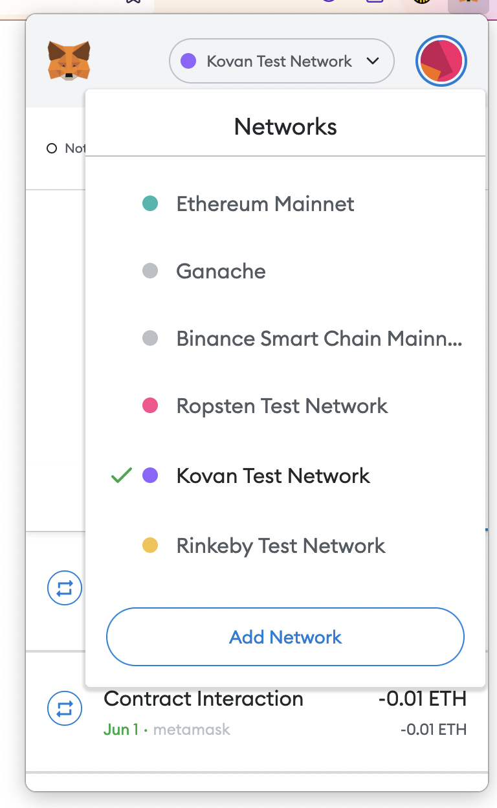
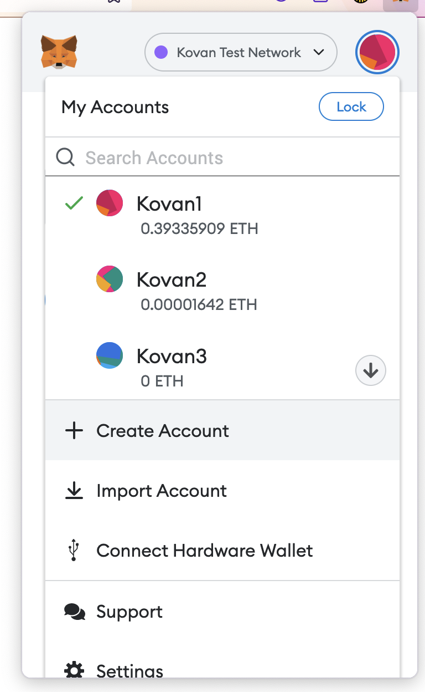
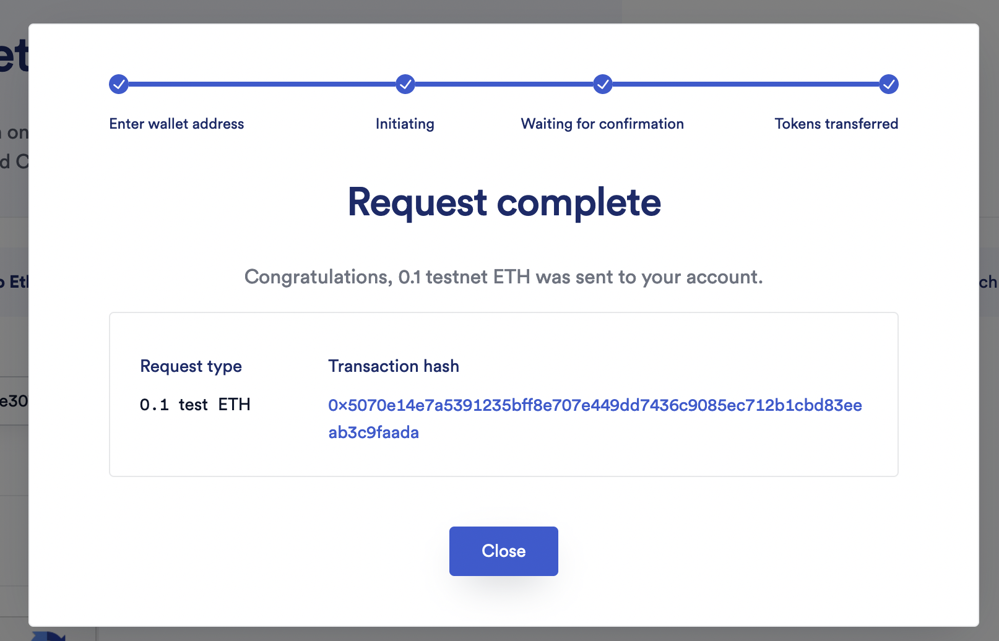
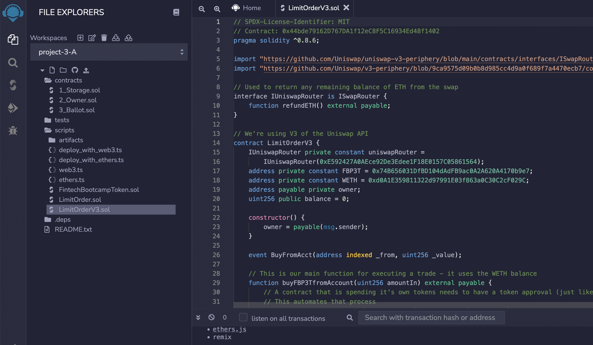
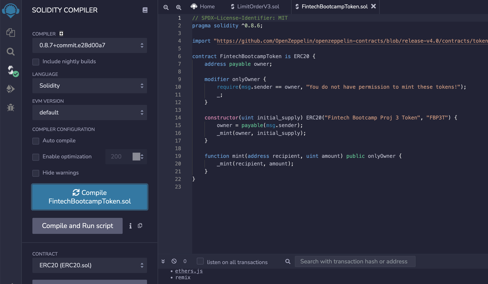
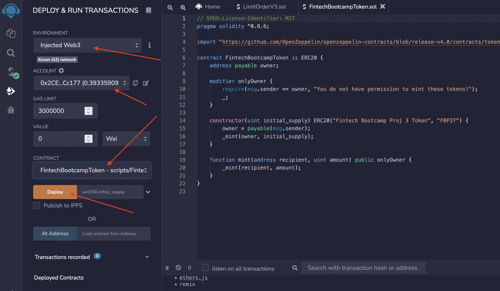
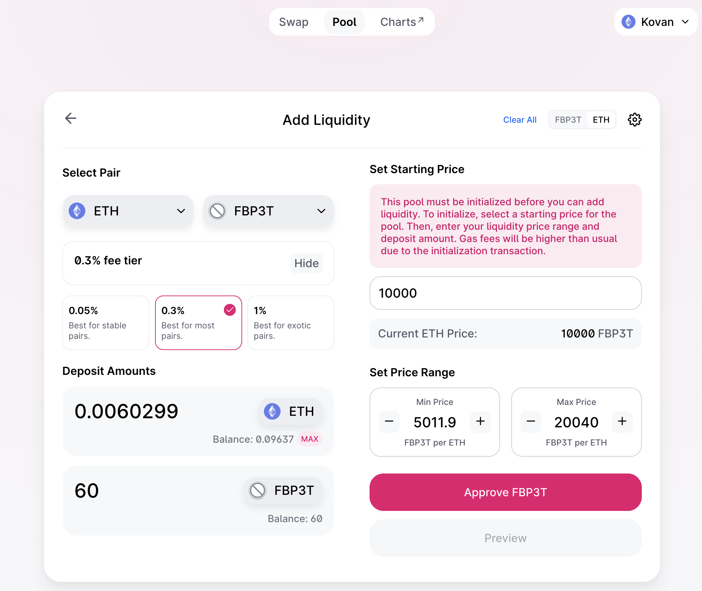

# Contract Deployment Instructions

- Select the Kovan Test Network in Metamask

  - If you aren't seeing Kovan as an option, go into the "Settings: Advance" section and enable "Show test networks"

- Create a new account for Kovan

  - WARNING: MetaMask via the browser extension doesn't make it easy to delete accounts that are created. Imported accounts don't have this issue, but those that are "created" appear to require re-installing the extension, in order to have them removed.

- Add ETH to your Wallet using [Request testnet LINK](https://faucets.chain.link/)

- Add the Solidity source files in the [Contracts](Contracts/) folder to Remix

- Compile the FintechBootcampToken in Solidity

- Select the Injected Web3 Environment
  - Your newly created Kovan account should be selected
- Select the FintechBootcampToken contract and click "Deploy"

- Open up [Uniswap](https://app.uniswap.org/#/add/ETH?chain=kovan) and create a Liquidity Pool (your Kovan account should be connected)

  - In this example we're using ETH and FBP3T - you'll need the contract address for the FBP3T token, which was created in a previous step

- Go back to Solidity and update the FBP3T address in LimitOrder.sol with the actual value of your FBP3T contract

- Compile LimitOrder.sol

- Select the LimitOrder contract and click "Deploy"
