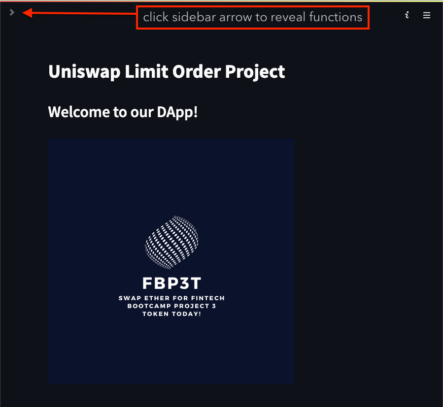
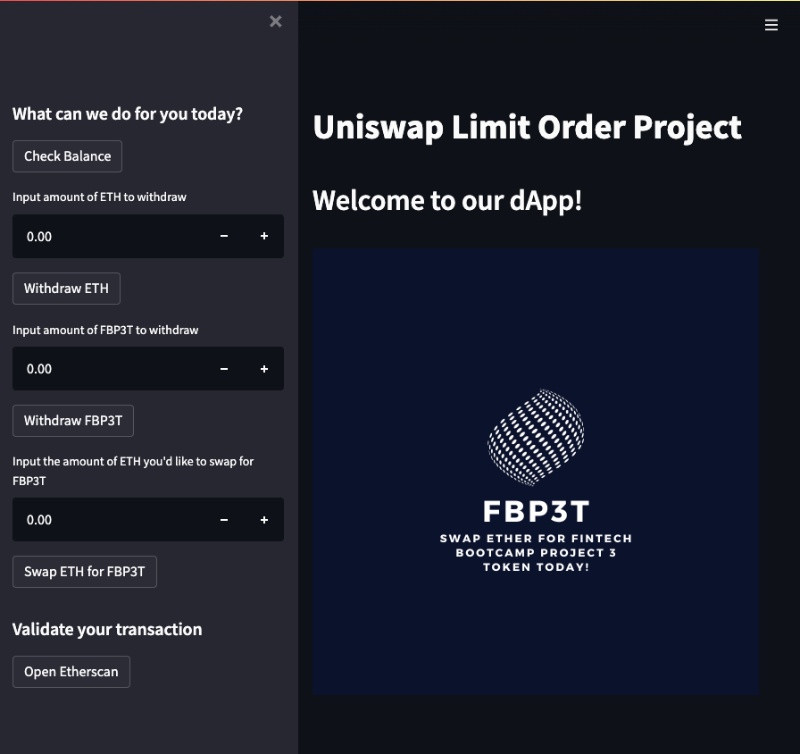
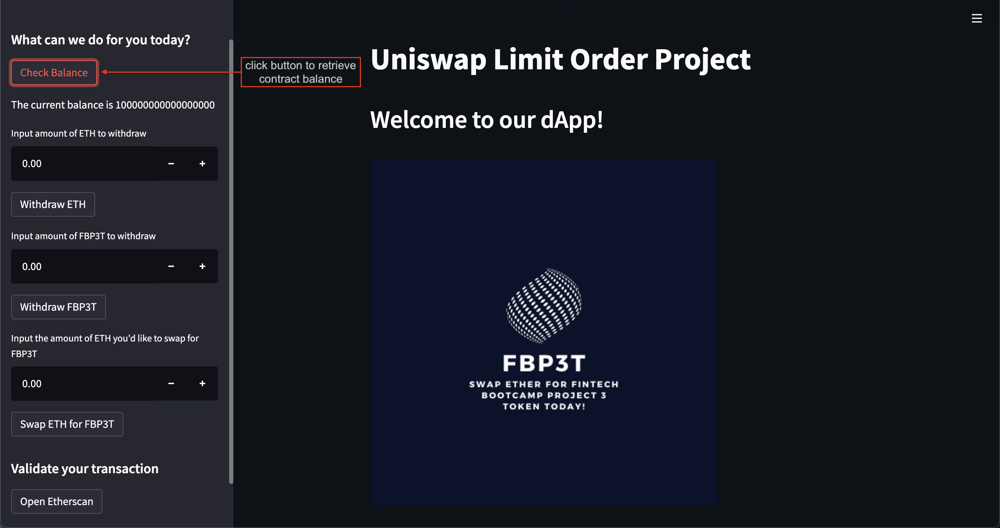
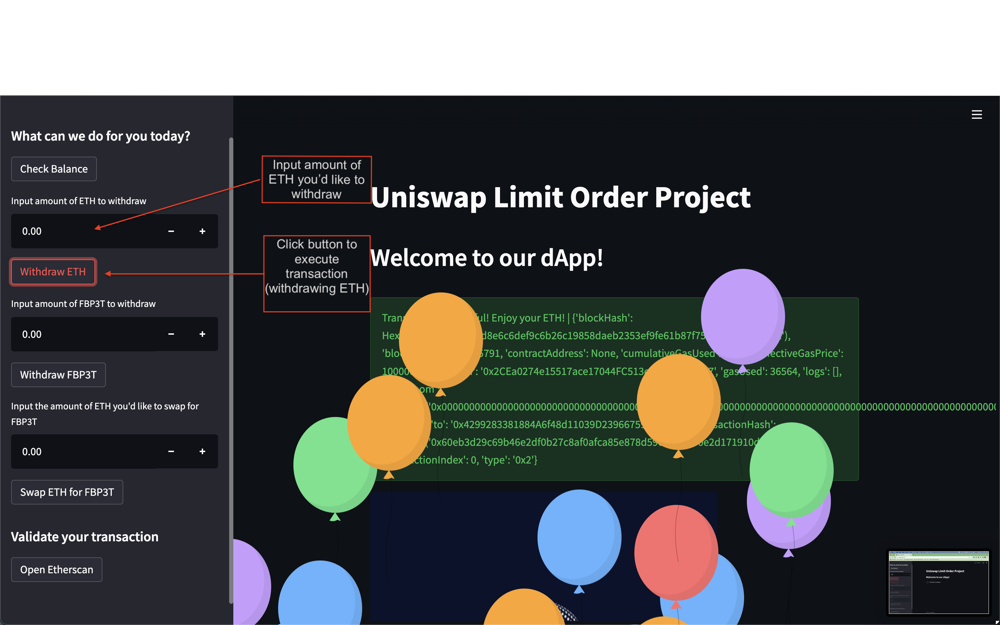
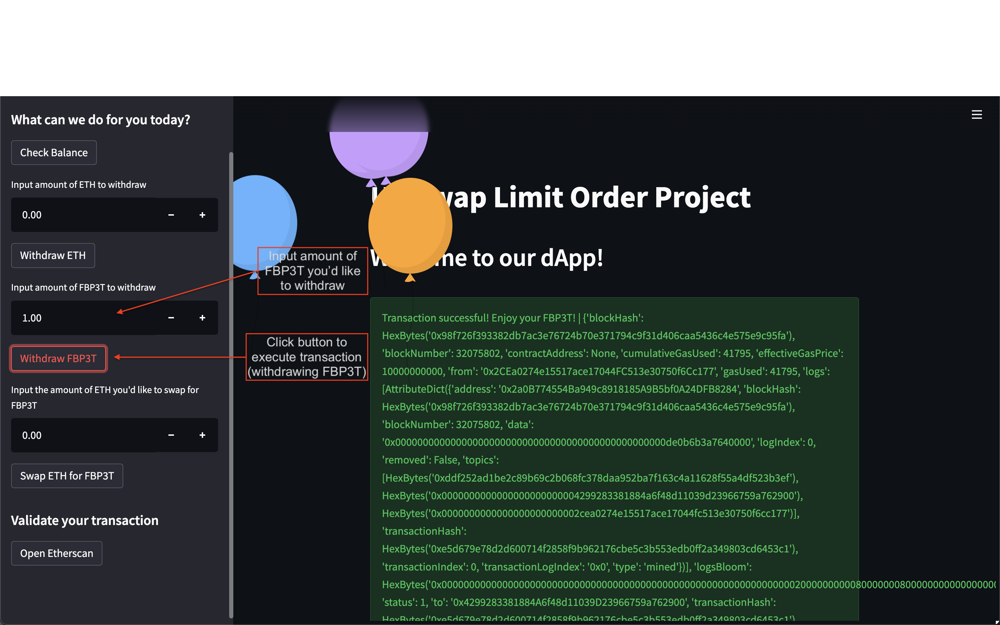
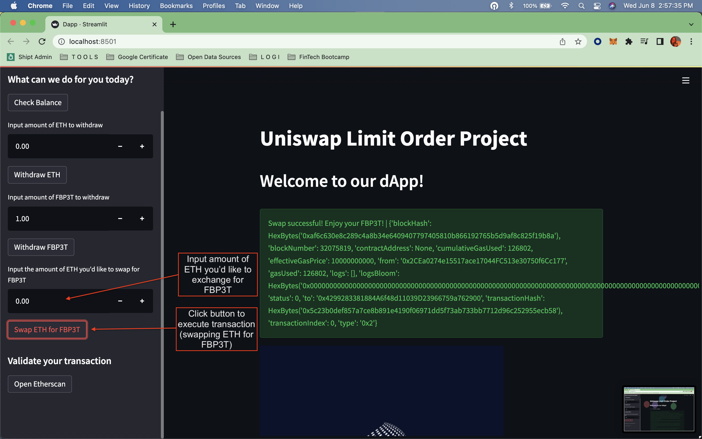
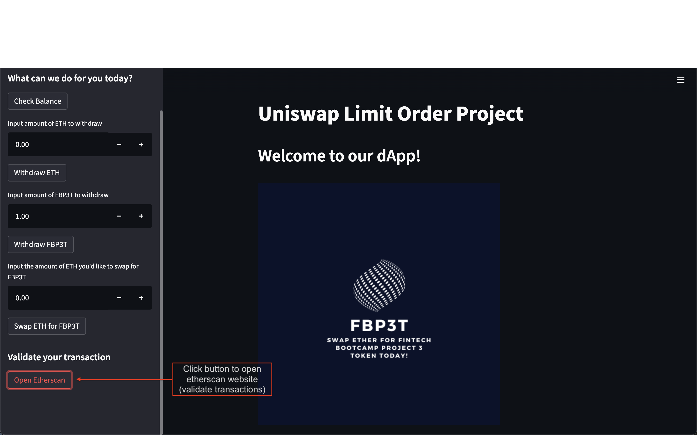

# dApp Walkthrough

- Welcome to the homepage!

- Here we can see all of our functions in the sidebar. Let's explore them! 

- Use the Check Balance button to retrieve the contract balance.

- Use the Withdraw ETH button (after inputting the desired amount) to withdraw ETH from the contract.

- Use the Withdraw FBP3T button (after inputting the desired amount) to withdraw FBP3T from the contract.

- Use the Swap ETH for FBP3T (after inputting desired amount) to exchange ETH for FBP3T.

- Use the Open Etherscan button to open a browser window to the relevant etherscan webpage where you can validate your transactions.

